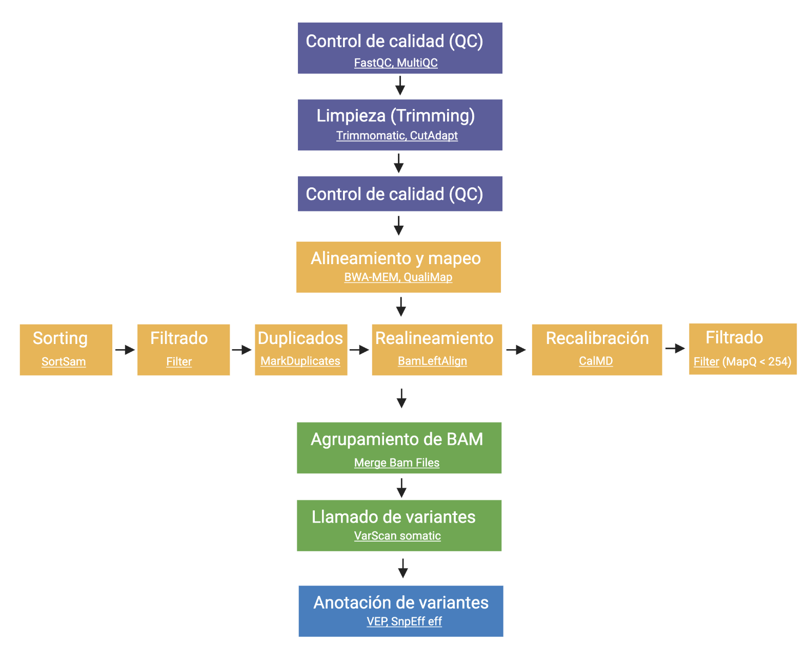

## Estudio de variantes genéticas en muestras de carcinoma adenoneuroendocrino mixto de esófago 

El presente repositorio contiene información sobre el análisis de variantes en muestras provenientes de carcinoma adenoneuroendocrino mixto de esófago (MANEC).  
Los datos fueron obtenidos del artículo [Mutation landscape and intra-tumor heterogeneity of two
MANECs of the esophagus revealed by multi-region sequencing](https://pubmed.ncbi.nlm.nih.gov/29050228/) con número de acceso de **SRA** [SRP079168](https://trace.ncbi.nlm.nih.gov/Traces/sra/?study=SRP079168).

El análisis completo de los datos se realizó empleando la plataforma de *Galaxy Europe*. En el siguiente enlace encontrarás el [análisis de los datos](https://usegalaxy.eu/u/rchavez91/h/esophag).  
Pipeline empleado:

En este enlace encontrarás [la presentación]()

