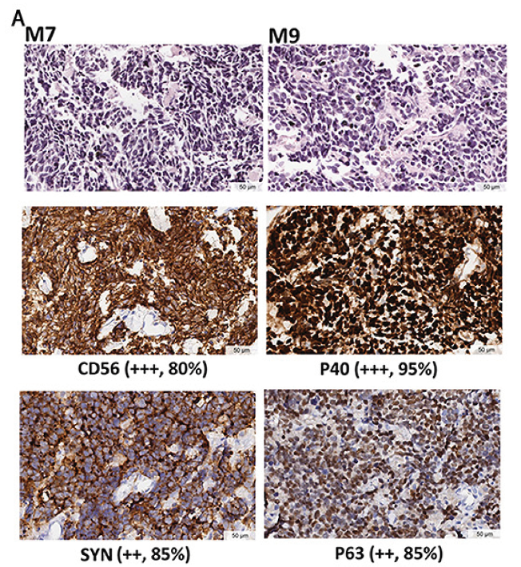

class: inverse, center, middle

# Antecedentes 

```{r setup, echo = F, include = F}
knitr::opts_chunk$set(echo = F)
```


```{r xaringan-themer, echo = F, include = F}
library(xaringanthemer)
style_mono_accent(base_color = "#23395b")
```

```{css, eval = T}
/* From https://github.com/yihui/xaringan/issues/147  */
.scroll-output {
  height: 80%;
  overflow-y: scroll;
}

/* From https://github.com/garthtarr/sydney_xaringan */
blockquote, .blockquote {
  display: block;
  margin-top: 0.1em;
  margin-bottom: 0.2em;
  margin-left: 5px;
  margin-right: 5px;
  border-left: solid 10px #0148A4;
  border-top: solid 2px #0148A4;
  border-bottom: solid 2px #0148A4;
  border-right: solid 2px #0148A4;
  box-shadow: 0 0 6px rgba(0,0,0,0.5);
  /* background-color: #e64626; */
  color: #e64626;
  padding: 0.5em;
  -moz-border-radius: 5px;
  -webkit-border-radius: 5px;
}

/* From https://github.com/garthtarr/sydney_xaringan */
.content-box-blue,
.content-box-gray,
.content-box-grey,
.content-box-army,
.content-box-green,
.content-box-purple,
.content-box-red,
.content-box-yellow {
  box-sizing: border-box;
  border-radius: 15px;
  margin: 0 0 15px;
  overflow: hidden;
  padding: 0px 20px 0px 20px;
  width: 100%;
}
```

```{r, eval = T}
library(RefManageR)
BibOptions(
  check.entries = FALSE, 
  bib.style = "authoryear", 
  cite.style = "authoryear", 
  style = "markdown",
  hyperlink = FALSE, 
  dashed = FALSE)
myBib = ReadBib("./MANEC.bib")
```

---
## MANEC

.pull-left[

- Carcinoma adenoneuroendocrino mixto

- MANEC de esófago baja incidencia

- Mal pronóstico

- Carcinoma de células pequeñas + células escamosas

- Más de 30 % de células tumorales con fenotipo mixto MANEC

- Positivo a un marcador neuroendocrino (CgA, SYN, CD56, NSE) o escamoso (P40, P63, CK 5/6)

]


.pull-right[

```{r, out.width="400px", fig.align='center', eval=T}

```

]


`r Citet(myBib,"yuanMutationLandscapeIntratumor2017")`

---
class: inverse, center, middle 

# Flujo de trabajo y metodología
---
class: inverse, center, middle

# Resultados
---
