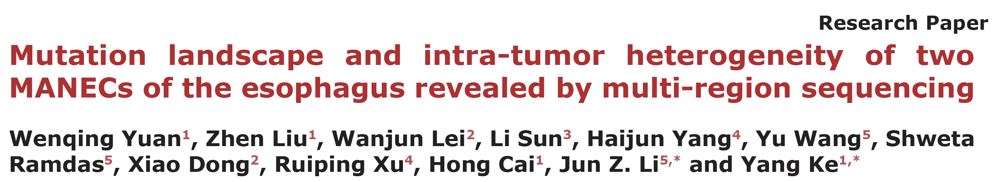
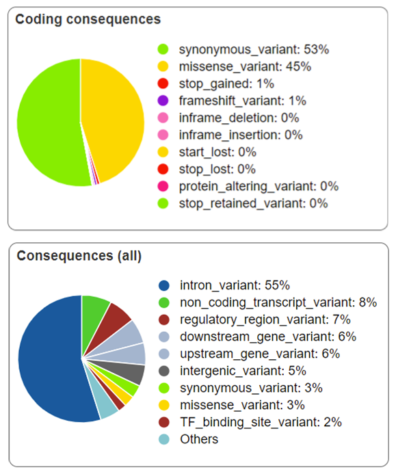
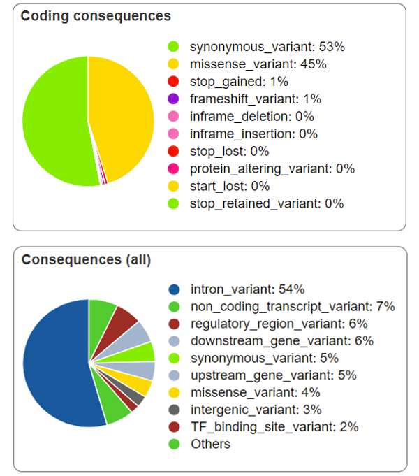
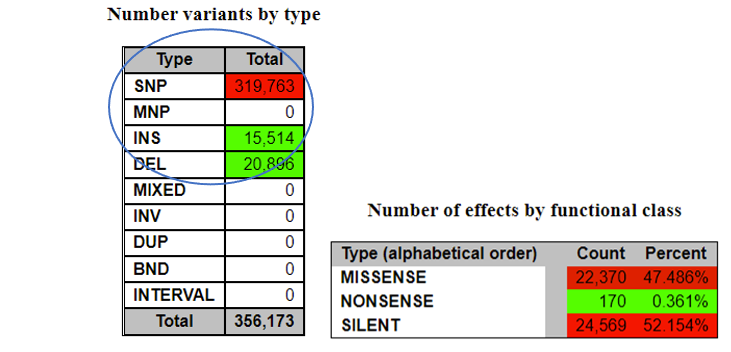
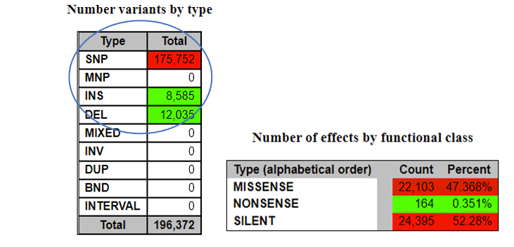
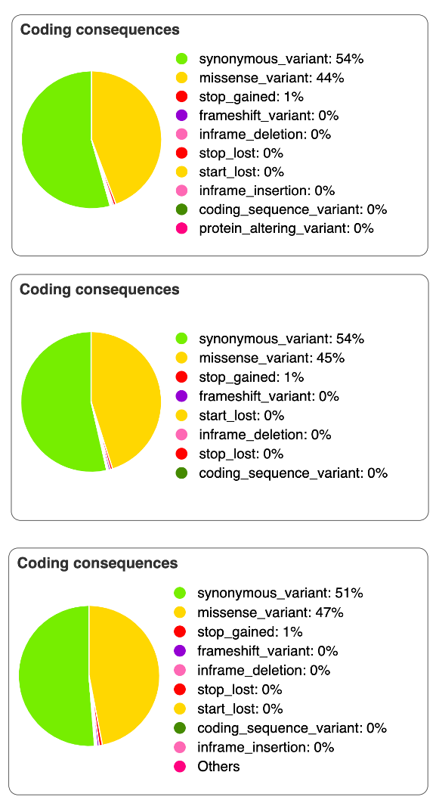
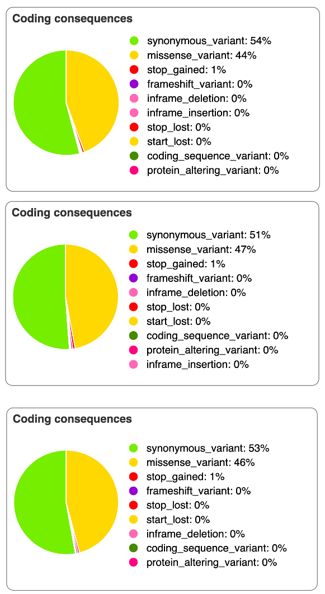
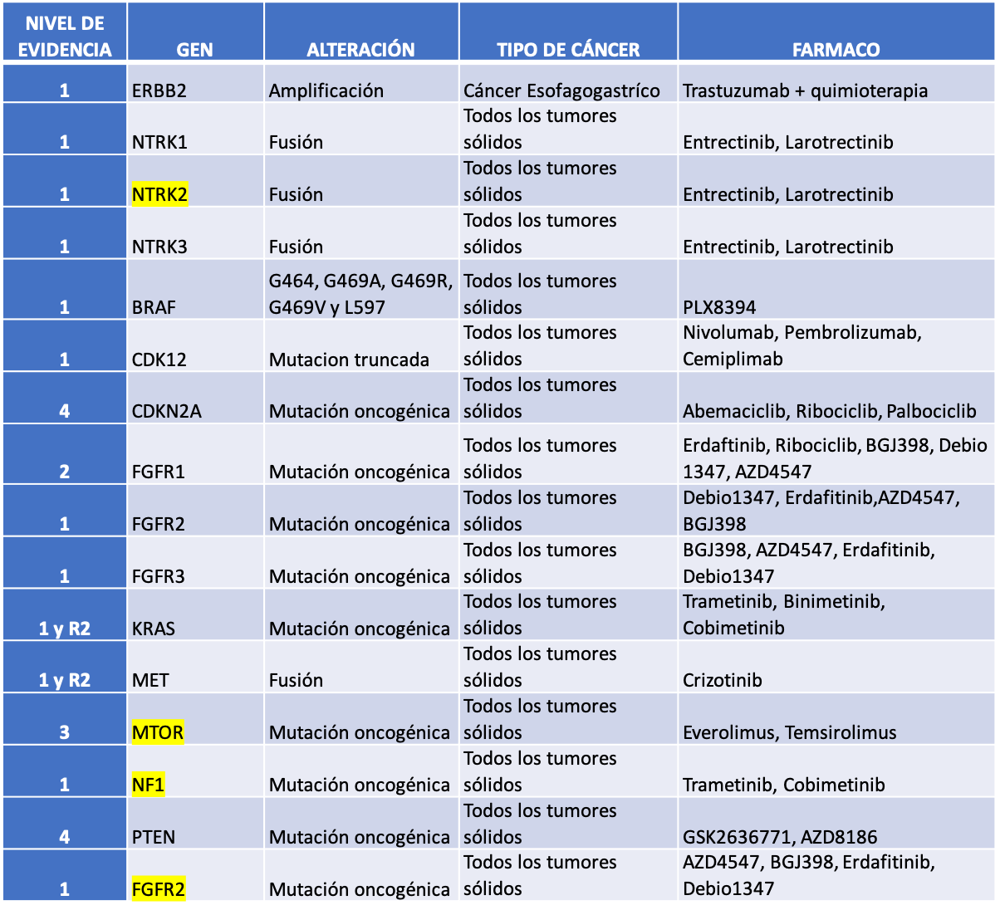

class: inverse, center, middle

# Antecedentes 

```{r setup, echo = F, include = F}
knitr::opts_chunk$set(echo = F)
```


```{r xaringan-themer, echo = F, include = F}
library(xaringanthemer)
style_mono_accent(base_color = "#23395b")
```

```{css, eval = T}
/* From https://github.com/yihui/xaringan/issues/147  */
.scroll-output {
  height: 80%;
  overflow-y: scroll;
}

/* From https://github.com/garthtarr/sydney_xaringan */
blockquote, .blockquote {
  display: block;
  margin-top: 0.1em;
  margin-bottom: 0.2em;
  margin-left: 5px;
  margin-right: 5px;
  border-left: solid 10px #0148A4;
  border-top: solid 2px #0148A4;
  border-bottom: solid 2px #0148A4;
  border-right: solid 2px #0148A4;
  box-shadow: 0 0 6px rgba(0,0,0,0.5);
  /* background-color: #e64626; */
  color: #e64626;
  padding: 0.5em;
  -moz-border-radius: 5px;
  -webkit-border-radius: 5px;
}

/* From https://github.com/garthtarr/sydney_xaringan */
.content-box-blue,
.content-box-gray,
.content-box-grey,
.content-box-army,
.content-box-green,
.content-box-purple,
.content-box-red,
.content-box-yellow {
  box-sizing: border-box;
  border-radius: 15px;
  margin: 0 0 15px;
  overflow: hidden;
  padding: 0px 20px 0px 20px;
  width: 100%;
}
```

```{r, eval = T, include=FALSE}
library(RefManageR)
BibOptions(
  check.entries = FALSE, 
  bib.style = "authoryear", 
  cite.style = "authoryear", 
  style = "markdown",
  hyperlink = FALSE, 
  dashed = FALSE)
myBib = ReadBib("./MANEC.bib")
packages <- c("tidyverse", "here", "gridExtra")
lapply(packages, library, character.only = T)
blank_theme <- theme_minimal()+
  theme(
    axis.title.x = element_blank(),
    axis.title.y = element_blank(),
    panel.border = element_blank(),
    panel.grid=element_blank(),
    axis.ticks = element_blank(),
    plot.title=element_text(size=14, face="bold"),
    legend.text = element_text(size = 13), 
    legend.title = element_text(face = "bold", size = 15), 
    axis.text.x = element_blank()
  )
  
```

---
## MANEC

.pull-left[

- Carcinoma adenoneuroendocrino mixto

- MANEC de esófago baja incidencia

- Mal pronóstico

- Carcinoma de células pequeñas + células escamosas

- Más de 30 % de células tumorales con fenotipo mixto MANEC

- Positivo a un marcador neuroendocrino (CgA, SYN, CD56, NSE) o escamoso (P40, P63, CK 5/6)

]


.pull-right[

```{r, out.width="400px", fig.align='center', eval=T}
knitr::include_graphics("./Screenshots/MANEC_histo.png")
```

]


`r Citet(myBib,"yuanMutationLandscapeIntratumor2017")`

---
## MANEC

Dada su similitud con el carcinoma pulmonar de células pequeñas se sabe que pueden presentarse alteraciones en: 

--

- *P53*

--

- *SOX2*

--

- *RB1*

--

.blockquote[Sin embargo, no existen reportes sobre las alteraciones somáticas en MANEC de esófago]

```{r, out.width="700px", fig.align='center'}

```

---
background-image: url("./Screenshots/Model.png")
background-position: 50% 60%
background-size: 100% 70%

## Modelo biológico
---
class: center, middle
## Hipótesis
Las variantes genómicas somáticas identificadas a través del análisis de datos de WES tienen un impacto en el desarrollo neoplásico distintivo del MANEC de esófago
---
class: inverse, center, middle 

# Flujo de trabajo y metodología
---
background-image: url("./Screenshots/Pipeline.png")
background-position: 50% 70%
background-size: 80% 81%

## Flujo de trabajo
---

background-image: url("./Screenshots/Pipeline_2_gray.png")
background-position: 45% 75%
background-size: 82% 80%

## Flujo de trabajo
---
background-image: url("./Screenshots/Pipeline_3_gray.png")
background-position: 45% 70%
background-size: 85% 80%

## Flujo de trabajo
---
class: inverse, center, middle

# Issues
---
## Issues `r fontawesome::fa("exclamation-circle", fill = "orange", position = "right")`

.pull-left[
`r icons::icon_style(icons::fontawesome("times-circle"), fill = "red")` 
Capacidad limitada en el espacio de las cuentas en Galaxy


`r icons::icon_style(icons::fontawesome("times-circle"), fill = "red")`
Velocidad de transferencia de archivos al servidor de Galaxy mediante ftp


`r icons::icon_style(icons::fontawesome("times-circle"), fill = "red")` 
Versiones obsoletas de algunos  programas en Galaxy

`r icons::icon_style(icons::fontawesome("times-circle"), fill = "red")` Tiempo de ejecución de los trabajos en Galaxy

]

--

.pull-right[
`r icons::icon_style(icons::fontawesome("check-circle"), fill = "green")` Borrar archivos de entrada de la historia de Galaxy una vez obtenido el *output*

`r icons::icon_style(icons::fontawesome("check-circle"), fill = "green")` Transferir archivos (fastq.gz) en grupos de dos en dos

`r icons::icon_style(icons::fontawesome("check-circle"), fill = "green")` Emplear las versiones más recientes de algunos programas (BamLeftAlign)

`r icons::icon_style(icons::fontawesome("check-circle"), fill = "green")` Enviar los trabajos en horarios donde el servidor estuviera libre
]
---
class: inverse, center, middle

# Resultados
---
## Variantes detectadas por contraste

.blockquote[Contrastes hechos con los archivos bam empalmados tanto de las muestras tumorales como las normales]

.pull-left[
.content-box-yellow[Tumor vs Normal]
```{r, out.width="280px", fig.align='left'}

```

]

.pull-right[
.content-box-red[Tumor vs sangre]
```{r, out.width="280px", fig.align='left'}

```

]

---
## Variantes detectadas por contraste

.pull-left[
.content-box-yellow[Tumor vs Normal]
```{r, out.width="400px", fig.align='left'}

```

]

.pull-right[
.content-box-red[Tumor vs sangre]
```{r, out.width="400px", fig.align='left'}

```

]

```{r, out.width="600px", fig.align='center'}
knitr::include_graphics("./Screenshots/Section_1.4.png")
```

---
## Frecuencia de mutaciones con impacto codificante
.scroll-output[

.blockquote[Contrastes hechos con los archivos bam individuales tanto de las muestras tumorales como las normales]

.pull-left[
.content-box-yellow[Tumor vs Normal]
```{r, out.width="200px", fig.align='left'}

```

]

.pull-right[
.content-box-red[Tumor vs Sangre]
```{r, out.width="200px", fig.align='default'}

```

]

]

---
## Frecuencia de mutaciones en genes codificantes
.scroll-output[
.blockquote[Seleccionando por biotipo de gen a aquellos codificantes para proteínas]
```{r, include = F}
files <- list.files(here("Data/txt_files"))
vcf <- vector("list")
for(i in files) {
  vcf[[sub("....$", "", i)]] <- read_delim(paste0(here("Data/txt_files/"), i), delim = "\t")
}
vcf <- map(vcf, ~filter(.x, BIOTYPE == "protein_coding"))

for(i in names(vcf)) {
  vcf[[i]] <- data.frame(table(vcf[[i]]$Consequence))
}

vcf <- map(vcf, ~rename(.x, Consequence = Var1) %>% mutate(Percentage = (Freq/sum(Freq))*100) %>% filter(Percentage >= 1))

plots <- vector("list")
for(i in names(vcf)) {
  plots[[i]] <- ggplot(vcf[[i]], aes(x = "", y = Percentage, fill = Consequence)) +
  geom_bar(stat = "identity", width = 1) +
  scale_fill_brewer(labels = paste(sub("_", " ", vcf[[i]]$Consequence),":",  round(vcf[[i]]$Percentage, digits = 2), "%")) +
  coord_polar("y", start = 0) +
  blank_theme +
  theme(axis.text.x = element_blank())
}
```

.pull-left[
.content-box-yellow[Tumor vs Normal]
```{r, out.width="400px", fig.align='left'}
grid.arrange(plots[["T1_vs_Normal1"]], plots[["T2_vs_Normal2"]], plots[["T3_vs_Normal3"]])
```

]

.pull-right[
.content-box-red[Tumor vs Sangre]
```{r, out.width="400px", fig.align='left'}
grid.arrange(plots[["T1_vs_Blood"]], plots[["T2_vs_Blood"]], plots[["T3_vs_Blood"]])
```

]

]  

---
background-image: url("./Screenshots/Section_4.png")
background-position: 50% 60%
background-size: 90% 60%
## Mutaciones accionables
---
## Mutaciones accionables

```{r, out.width="800px", fig.align='center'}

```


.pull-left[
.blockquote[- Cáncer esofagogástrico
- Carcinoma de células escamosas de esófago]
]

.pull-right[
```{r, out.width="500px", fig.align='center'}

```

]

---
background-image: url("./Screenshots/Section_4.2.png")
background-position: 50% 60%
background-size: 90% 60%
## Mutaciones accionables
---
background-image: url("./Screenshots/Comparison.png")
background-position: 50% 70%
background-size: 80% 60%
## Comparación de hallazgos con el trabajo original

---
Las muestras tumorales provenientes del MANEC de esófago presentan alteraciones genómicas por lo que el análisis de datos de WES identificará  **Mutaciones particulares del MANEC Proceso carcinógenico asociado**

El análisis de datos de WES identificará las variantes genómicas somáticas específicas del MANEC de esófago que tienen un impacto en su proceso carcinogénico o una consecuencia funcional  
---